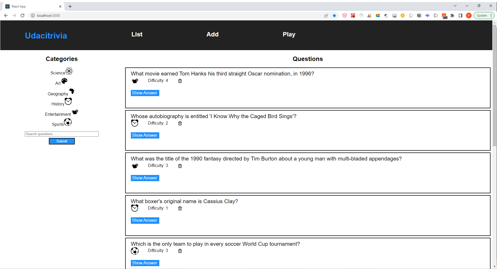

# Trivia App

> The Trivia App allows users to manage and play trivia games from a web page. This project demonstrates a fullstack app powered by a Flask API and a React frontend.


## Trivia App demo




## Overview

The application showcases the following features:

* Display questions - both all questions and by category. Questions should show the question, category and difficulty rating by default and can show/hide the answer.
* Delete questions.
* Add questions and require that they include question and answer text.
* Search for questions based on a text query string.
* Play the quiz game, randomizing either all questions or within a specific category.
* Object-oriented thinking in Python, including abstract classes, class methods, and static methods.
* DRY (don't repeat yourself) principles of class and method design.
* Working with modules and packages in Python.
* Coding best practices for style and documentation
* Ensuring that code, docstrings, and comments adhere to [PEP 8 Standards](https://www.python.org/dev/peps/pep-0008/).


## Installation

### Requirements
The project requires `pip` installed.

If you do not have `pip` installed, you can download it here: [pip](https://pip.pypa.io/en/stable/installing/)

### Setup

1. **Create an empty database (trivia) in postgres locally:
```sh
$ createdb -U postgres trivia
```

2. **Create an empty test database (trivia_test) in postgres locally:
```sh
$ createdb -U postgres trivia_test
```

3. **Clone the source locally:
```sh
$ git clone https://github.com/thepembeweb/trivia_app.git
```

4. **Navigate to the backend folder:
```sh
$ cd trivia_app/backend
```

5. **Initialize and activate a virtualenv using:**
```
python -m virtualenv env
source env/bin/activate
```
>**Note** - In Windows, the `env` does not have a `bin` directory. Therefore, you'd use the analogous command shown below:
```
source env/Scripts/activate
```

6. **Install project dependencies:
```sh
$ pip install -r requirements.txt
```

7. **Run the development server:**
```
export FLASK_APP=flaskr
export FLASK_ENV=development # enables debug mode
flask run
```

8. **Verify on the Browser**<br>
Navigate to project homepage [http://127.0.0.1:5000/](http://127.0.0.1:5000/) or [http://localhost:5000](http://localhost:5000)

9. **Navigate to the frontend folder:
```sh
$ cd trivia_app/frontend
```

10. **Install project dependencies:
```sh
$ npm install
```

11. **Start the app in development mode:
```sh
$ npm start
```

12. **Open the browser at localhost:3000


## Built With

* [Python 3](https://www.python.org/) - The programming language used
* [Flask](https://palletsprojects.com/p/flask/) - The web framework used
* [Postgres](https://www.postgresql.org/) - Relational Database used
* [Flask-Migrate](https://flask-migrate.readthedocs.io/en/latest/) - Database Migration manager
* [SQLAlchemy ORM](https://sqlalchemy.org/) - ORM library


## Authors

* **[Pemberai Sweto](https://github.com/thepembeweb)** - *Initial work* - [Trivia App](https://github.com/thepembeweb/trivia_app)

## License

[](http://badges.mit-license.org)

- This project is licensed under the MIT License - see the [LICENSE.md](LICENSE.md) file for details
- Copyright 2022 © [Pemberai Sweto](https://github.com/thepembeweb).
